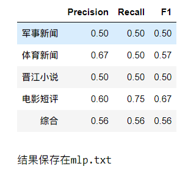

| 模型                       | 代码                          |
| -------------------------- | ----------------------------- |
| 朴素贝叶斯                 | 朴素贝叶斯.py                 |
| MLP                        | MLP.ipynb                     |
| Bert                       | BERT.ipynb                    |
| XLNet                      | run_classifier.py             |
| TextRNN, TextCNN, TextRCNN | TextRNN, TextCNN, TextRCNN/*. |

# 数据集读取

用法：

```python
from utils.data_loader import load_data

train,test=load_data('./小组作业-语料/') # 输入存放数据集的文件夹即可读取数据集，数据集已经过shuffle
```

格式：

```python
[
    ["中国将军团8年来首访日本 日方希望加强和中国沟通",1],
    ["他一张脸都皱紧了",4],
]
```

# 结果评测

用法：

```python
from utils.score import score

score(label_truth,label_predict,output_filename='mlp.txt')
# label_truth和label_predict均为整数list
# output_filename参数可选
```

示例：

```python
label_truth=[1,2,3,5,1,2,3,5,1,2,3,5,1,2,3,5]
label_predict=[2,5,5,5,3,2,3,1,1,2,1,5,1,3,3,5]

score(label_truth,label_predict,output_filename='mlp.txt')
```




